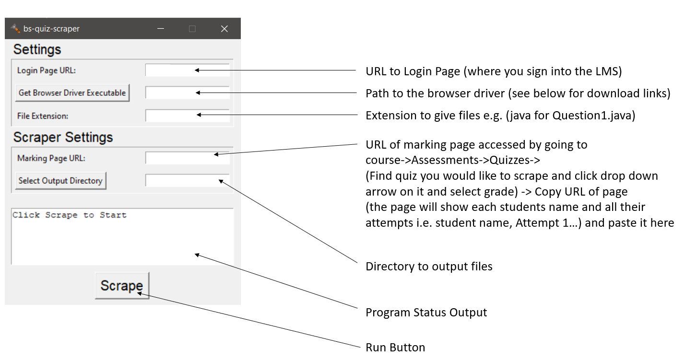

# bs-quiz-scraper

Cross platform Brightspace (LMS) quiz scraper made for plagarism analysis writen in python3 using BS4, Selenium and tkinter.

Pulls all non-true/false questions as individual files with a specified file extension to a specified output directory for a specified quiz on brightspace LMS.

## Instructions

### Launch Using Python

Using a terminal opened in the project directory run the following commands:

For Mac/Linux:

```
pip install virtualenv
python venv ./venv
source ./venv/Scripts/activate
pip install
python bsQuizScraper.py
```

For Windows:

```
pip install virtualenv
python venv .\venv #windows
start .\venv\Scripts\activate.bat
#In newly launched cmd window run:
pip install
python bsQuizScraper.py
```

### Run Instructions



#### Browser Driver Executables

I recommend using Mozillas GeckoDriver it is what this program was tested with. You can download the executable from:

https://github.com/mozilla/geckodriver/releases
